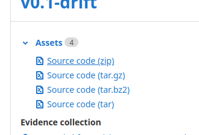

Assembly of components
======================

While not available yet, the gc-1000-gps drop in motherboard replacement will be a very effective way to upgrade your system.

To get started, you will need

* Solder and soldering iron.
* all included components.
* an `Arduino Mega <https://store.arduino.cc/usa/mega-2560-r3>`_ plugged into your computer.
* All dependencies_ required to build the code.

*****************
Building the code
*****************

There are two methods for getting the code, you can download a release, or build from ``main``

Build from a release
####################

To build from a release, go to the releases_ page on our gitlab, and select the most recent release.

Download a copy of the sourcecode and extract it to your computer.

Open a terminal in the extracted repository.

.. code-block:: shell

    cd gc-1000-gps
    make
    make upload

Build from ``main``
###################

Building from the main branch may result in more experimental but more up to date features and stability.

Start by cloning the repo down, then CD to the build location and build the code.

.. code-block:: shell

    git clone https://gitlab.com/KenwoodFox/gc-1000-gps
    cd gc-1000-gps/gc-1000-gps
    make
    make upload

Troubleshooting
###############

If you get an error such as ``avrdude: ser_open(): can't open device "unknown": No such file or directory`` your mega might not be plugged in or may not have enough power over usb to turn on.

If you get an error such as ``command not found: arduino-cli`` make sure you installed all dependencies_. 

.. _dependencies: <https://gitlab.com/KenwoodFox/gc-1000-gps#setup>
.. _releases: <https://gitlab.com/KenwoodFox/gc-1000-gps/-/releases>
