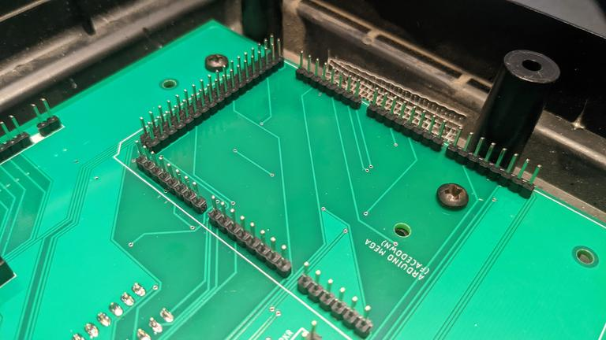

Assemble the GC-1000-GPS
========================

You've got your hands on a gc-1000-gps circuit board! Congrats! We hope you like it.

For these instructions, you will need:

* Solder and soldering iron.
* all included components.
* an `Arduino Mega <https://store.arduino.cc/usa/mega-2560-r3>`_ plugged into your computer.
* All dependencies_ required to build the code.

.. warning::
    This section of the documentation is applicable only to ``v0.2``
    boards and above, and firmware versions ``v0.2-x``.

Soldering the new board
#######################

.. note::
    It can be very helpful to install the DIP switches last, as they make it awkward when assembling the parts on the top of the board.

Prepare the board to be soldered, collect all components, heat your iron. We recomend solid core solder, and flux paste.

I installed the chips and sockets first but a specific order is not required. 

Generally its easier to install the shorter components first.

Once the chips are done, installing all of the headers are generally best.

When soldering the arduino mega pins, to assure alignment, 
it can be helpful to populate all of its pins first. Once this is done, place it on the board and solder from behind.

.. image:: images/arduino_mega.jpg
  :height: 250
  :alt: Arduino Mega with pins installed

After soldering the pins, when you remove the mega, all should be straight and alligned to fit inside it.

.. note::
    The display board also needs male header pins.

Several components such as the VRM, the GPS and the RTC need **female** header pins, install these next.

Open the packaging for the GPS and RTC from adafruit, solder on the male pins and optionally, clock battery covers.

The board is nearly complete, all components should look like this:

The last step should be to install the dip switches, take note of the indicated direction.

Thats it! move onto the next step, :ref:`Dissasembly/Upgrade`.

Dissasembly/Upgrade
###################

Before we can begin assembly of your gc-1000-gps, we need to dissasemble it.

Find the four screws installed on the bottom, unscrew them to remove the cover.

.. image:: images/before_disassembly.jpg
  :height: 250
  :alt: Cover Removed

Once the cover is removed, remove the **display board** and put it aside.

Remove the circuit board by unscrewing the **four small plastic screws** and the **two metal screws** attaching the transformer to the case.

You should be left with just the bottom case!

Install the GC-1000-GPS upgrade board and install all 6 screws you removed in the previous step.

Install the display board on the upgrade board.

.. warning::
    The display board connector can be fragile, take care when installing it.

With the display board installed, replace the top cover (making
sure to **plug the speaker into the new speaker header**).

Then reinstall the 4 screws on the bottom, and, you're done! Congrats!

The next step is :ref:`Loading the Firmware`.

.. _dependencies: https://github.com/ac1ja/gc-1000-gps#setup
