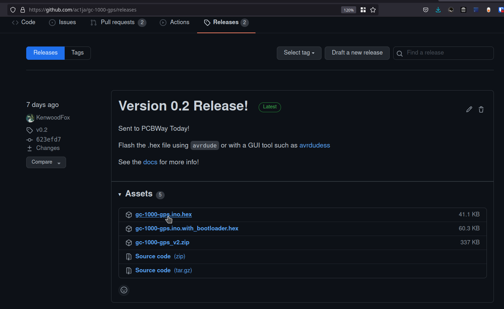
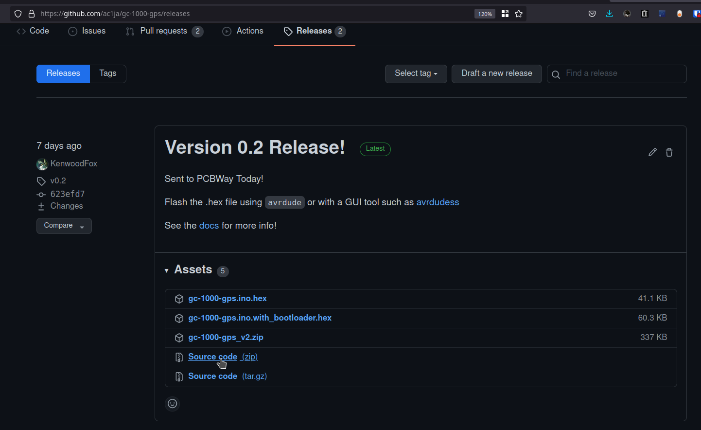

Loading the firmware
====================

There are three methods for getting the firmware, you can download a precompiled release, compile a
release yourself or build from ``main`` directly.

Flash a precompiled binary
##########################

This method is generally the easiest.

.. note::
  If you purchased a kit from us, you do not need to flash a new version unless a newer version is released.

Start by downloading a binary file from github

.. note::
  As long as you are flashing over USB/UART you do not need the .hex file with bootloader, only those
  who are flashing ISP need this hex file.

You can flash via a gui tool such as AVRDUDESS_ or avrdude, **you will need to have at lease one of 
these programs installed.**

.. code-block:: shell

    # Flashing with avrdude
    avrdude -p m2560 -c stk500v2 -P /dev/ttytACM0 -b 115200 -F -U flash:w:/path/to/gc-1000-gps.hex

See AVRDUDESS_'s docs for information on how to use it to flash your hex file.

Build from a release
####################

To build from a release, go to the releases_ page on our github, and select the source code for 
our most recent release.

Download a copy of the sourcecode and extract it to your computer.

Open a terminal in the extracted repository. The firmware is built and managed using Platformio, If
you don't have platformio, see the dependencies_ section to install it on your machine.

.. code-block:: shell

    cd firmware
    make
    make upload

Build from ``main``
###################

Building from the main branch may result in more experimental but more up to date features and stability.

Start by cloning the repo down, then CD to the build location and build the code. Use the same steps
as above.

.. code-block:: shell

    git clone https://github.com/ac1ja/gc-1000-gps
    cd gc-1000-gps/firmware
    make
    make upload

Troubleshooting
###############

If you get an error such as ``avrdude: ser_open(): can't open device "unknown": No such file or directory`` 
your mega might not be plugged in or may not have enough power over usb to turn on.

If you get an error such as ``command not found: arduino-cli`` make sure you installed all dependencies_. 

.. _dependencies: https://github.com/ac1ja/gc-1000-gps#setup
.. _releases: https://github.com/ac1ja/gc-1000-gps/releases
.. _AVRDUDESS: https://github.com/zkemble/AVRDUDESS
