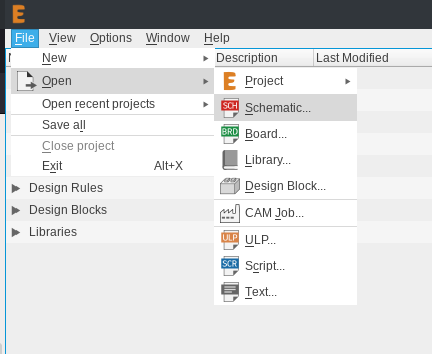
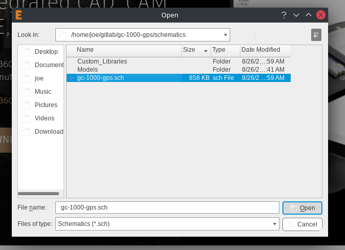
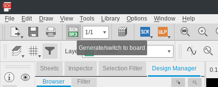
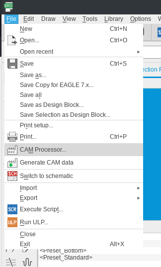
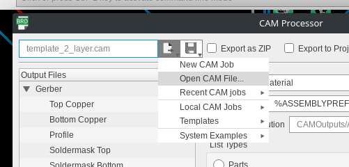
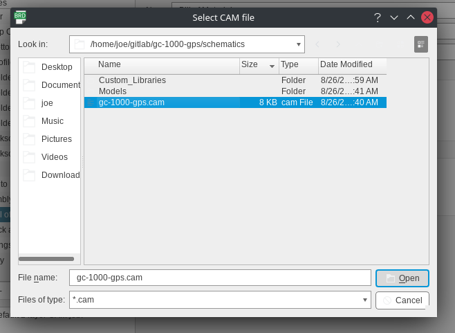
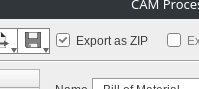
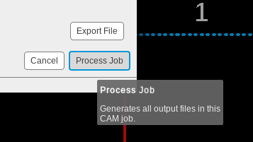
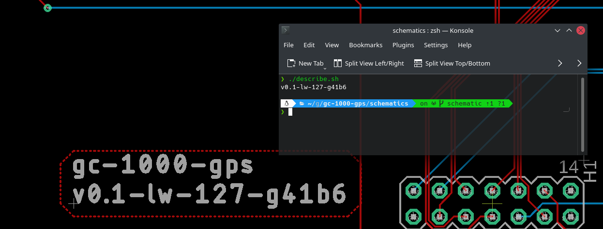

Contributing
============

We could use your help developing this software! All of which is free and open source under GPLv3_.

.. note::

  If you are only interested in getting your gc-1000 upgraded,  
  this is not the section for you, see the :ref:`Getting Started` section for that!

Notes on formatting
###################

Use only lowercase comments

.. code-block:: cpp

    // this is a comment
    
    /* this comment uses
     * some features of
     * the GPS module.
     */

The docs makefile
#################

The makefile included with this build of the docs has several new features for
assisting generating new docs, most prominant being the

.. code-block:: shell

    make graphics

option, allowing you to render .drawio graphics or other graphics into PNG images.

Using Autodesk Eagle
####################

All of the circut design is made with Autodesk Eagle and stored in ``schematics``.

Generating a CAM file
---------------------

To start, begin by installing autodesk eagle on your system, then with the git repo cloned, see :ref:`Build from \`\`main\`\`` for how to do that.

First use the file manager to navigate to the ``.sch`` file, and open it.

Then switch to board view

The board viewer should open, next open the CAM processor

Use the included ``.cam`` file from the repo.

Make sure export as zip is checked.

Thats it! Process the job and you're good.

Contributing Notes
------------------

When pushing any changes back to ``schematic`` or another development branch please be sure to update the has on the silkscreen especially before doing a CAM job.

The included script ``describe.sh`` can help automate this.

.. _GPLv3: https://www.gnu.org/licenses/quick-guide-gplv3.en.html
