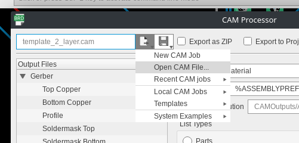
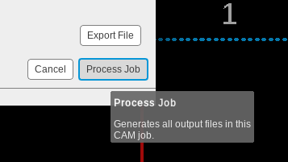

Developing
==========

We could use your help developing this software! All of which is free and open source under ~~GPLv3~~.

Notes on formatting
###################

Use only lowercase comments

.. code-block:: cpp

    // this is a comment
    
    /* this comment uses
     * some features of
     * the GPS module.
     */

Unsorted Notes
##############

Move these

.. code-block:: cpp

    // IC1 - 74HC595 (LS Byte)
    // bits 0 - 3 are going to pins 5, 3, 2 and 4 on the MC14543 BCD-to-Seven segment decoder
    // bits 4 - 6 are going to IC3 - 74HC138 3-to-8 line decoder

    // IC2 - 74HC595 (MS Byte)
    // bit 0 - Q131 (AM LED)
    // bit 1 - Q129 (PM LED)
    // bit 2 - Q128 (HiSpec LED)
    // bit 3 - Q127 (Capture LED)
    // bit 4 - Q126 (15 MHz LED)
    // bit 5 - Q125 (10 MHz LED)
    // bit 6 - Q124 (5 MHz LED)
    // bit 7 - Data LED

    // IC3 - 74HC238
    // bit 0 - Q116 (Hour - Tens)
    // bit 1 - Q117 (Hour - Ones)
    // bit 2 - Q118 (Min - Tens)
    // bit 3 - Q119 (Min - Ones)
    // bit 4 - Q121 (Sec - Tens)
    // bit 5 - Q122 (Sec - Ones)
    // bit 6 - Q123 (Tenth-Sec)

The docs makefile
#################

The makefile included with this build of the docs has several new features for
assisting generating new docs, most prominant being the

.. code-block:: shell

    make graphics

option, allowing you to render .drawio graphics or other graphics into PNG images.

Using Autodesk Eagle
####################

All of the circut design is made with Autodesk Eagle and stored in ``schematics``.

Generating a CAM file
---------------------

To start, begin by installing autodesk eagle on your system, then with the git repo cloned, see :ref:`Build from \`\`main\`\`` for how to do that.

First use the file manager to navigate to the ``.sch`` file, and open it.

.. image:: images/eagle_tutorial/load_sch.png
  :width: 525
  :alt: File Menu Dropdown

.. image:: images/eagle_tutorial/open_from_repo.png
  :width: 525
  :alt: Open In File Menu

Then switch to board view

.. image:: images/eagle_tutorial/open_board.png
  :width: 525
  :alt: Switch to board view

The board viewer should open, next open the CAM processor

.. image:: images/eagle_tutorial/open_cam_processor.png
  :width: 480
  :alt: File Dropdown

Use the included ``.cam`` file from the repo.

.. image:: images/eagle_tutorial/select_cam.png
  :width: 525
  :alt: Select CAM file in file viewer

Make sure export as zip is checked.

.. image:: images/eagle_tutorial/export_as_zip.png
  :width: 480
  :alt: Export As zip

Thats it! Process the job and you're good.

Contributing Notes
------------------

When pushing any changes back to ``schematic`` or another development branch please be sure to update the has on the silkscreen especially before doing a CAM job.

.. image:: images/eagle_tutorial/describe_board_version.png
  :width: 525
  :alt: Dip Settings

The included script ``describe.sh`` can help automate this.
