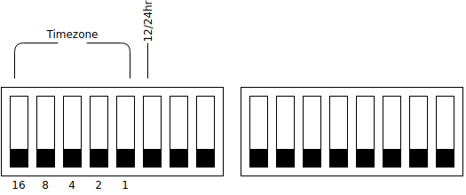
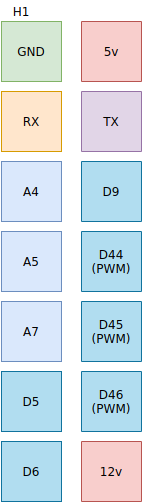
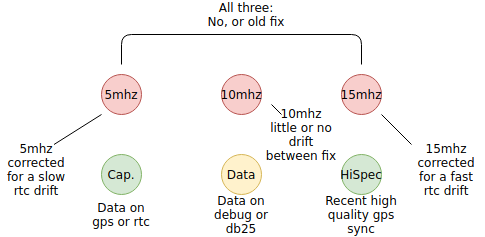

Usage
=====

Using the DIP switches
######################

On the bottom of the gc-1000-gps board there should be two banks of 16 dip switches total, their pinouts are shown below:

These switches allow the user to set the timezone and other behavior settings.

Set the timezone
################

Using the first five switches, configure your timezone offset starting from UTC-12, use the chart below

.. list-table:: gc-1000-gps timezone options
    :widths: 10 15
    :header-rows: 1
    
    * - DIP Setting
      - Timezone
    * - 00000
      - UTC-12
    * - 00001
      - UTC-11
    * - 00010
      - UTC-10
    * - 00011
      - UTC-9
    * - 00100
      - UTC-8
    * - 00101
      - UTC-7
    * - 00110
      - UTC-6
    * - 00111
      - UTC-5
    * - 01000
      - UTC-4
    * - 01001
      - UTC-3
    * - 01010
      - UTC-2
    * - 01100
      - UTC-1
    * - 01101
      - UTC
    * - 01110
      - UTC+1
    * - 01111
      - UTC+2
    * - 10000
      - UTC+3
    * - 10001
      - UTC+4
    * - 10010
      - UTC+5
    * - 10011
      - UTC+6
    * - 10100
      - UTC+7
    * - 10101
      - UTC+8
    * - 10110
      - UTC+9
    * - 10111
      - UTC+10
    * - 11000
      - UTC+11
    * - 11001
      - UTC+12
    * - 11010
      - NOT IMPLEMENTED
    * - 11011
      - NOT IMPLEMENTED
    * - 11100
      - NOT IMPLEMENTED
    * - 11101
      - NOT IMPLEMENTED
    * - 11110
      - NOT IMPLEMENTED
    * - 11111
      - NOT IMPLEMENTED

While fractional timezones are currently not settable via dip switches, we welcome
users to submit a PR to add aditional timezones to the list, see :ref:`Contributing`.

Set the 12/24 format
####################

Optionally, you can change the clock from 12 to 24 hour mode using pin 6 on the first dip switch.
See the diagram above.

The User Header
###############

Introduced in ``v0.1-lw-90`` a 2x7 pin header on the board allows user expandability with several analog and digital pins arranged in this arrangement.

The mega's ``serial`` interface is also broken out onto this user header to allow for even more functionality.

Functions of the lights
#######################

Because gc-1000-gps is also a hardware replacement, some lights have new functions, see diagram below.

